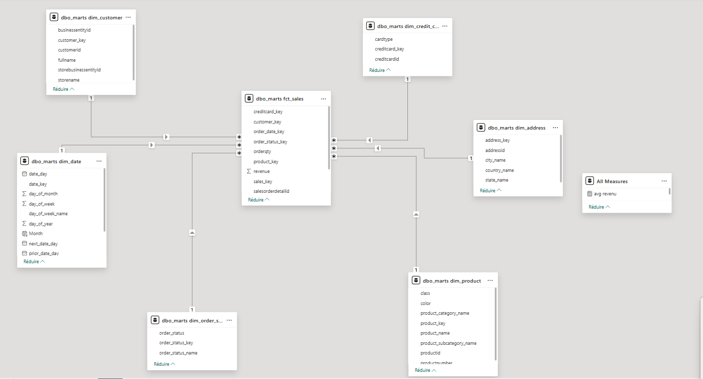
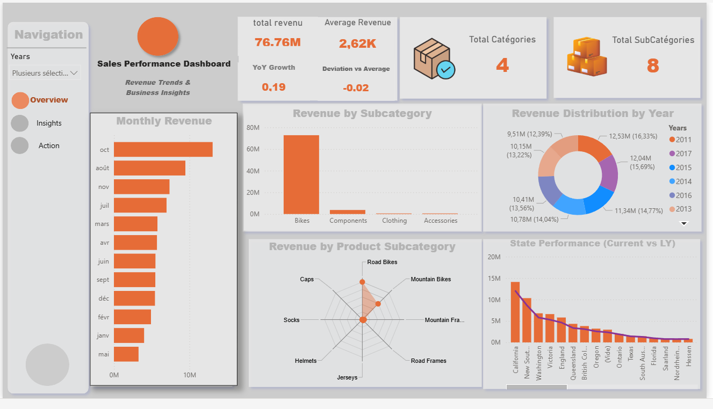

# 🚀 Modern Sales Analytics Stack

End-to-end data pipeline project covering data ingestion, transformation, data modeling, and business intelligence visualization.

---

## 🎯 Objective

The goal of this project is to design and implement a complete analytics pipeline that transforms raw sales data into actionable business insights.

This project follows modern data stack principles, combining data engineering, analytics engineering, and business intelligence.

---

## 🏗️ Architecture

The pipeline is structured as follows:

* **Data Source**: Raw CSV sales data
* **Database**: PostgreSQL
* **Transformation Layer**: dbt Core (staging → intermediate → marts)
* **Data Modeling**: Star schema (fact & dimensions)
* **Visualization**: Power BI
* **Metrics Layer**: DAX measures

---

## ⚙️ Tech Stack

* PostgreSQL
* dbt Core
* Power BI
* DAX

---

## 🔄 Data Pipeline

1. **Data Ingestion**

   * Raw sales data loaded into PostgreSQL

2. **Data Cleaning**

   * Handling missing values (e.g., OrderDate imputation)
   * Removing inconsistent or orphan records

3. **Data Transformation (dbt)**

   * Staging models (`stg_`)
   * Intermediate transformations (`int_`)
   * Mart layer (`fct_`, `dim_`)

4. **Data Modeling**

   * Star schema design using fact and dimension tables

5. **Metrics Calculation**

   * Business KPIs implemented using DAX

6. **Visualization**

   * Interactive dashboard in Power BI

---

## 🏗️ Data Modeling (Kimball Approach with dbt)

This project follows the Kimball dimensional modeling methodology to structure data for analytics.

### ⭐ Star Schema Design

The data model is organized into:

* **Fact Table**

  * `fct_sales`: transactional sales data (revenue, quantity, etc.)

* **Dimension Tables**

  * `dim_date`: calendar and time attributes
  * `dim_product`: product hierarchy (category, subcategory)
  * `dim_customer`: customer-related attributes

### 📸 Star Schema (Power BI Model)

<!-- ADD IMAGE HERE -->



---

## 🔄 dbt Transformation Layers

### 1. Staging Layer (`stg_`)

* Raw data cleaned and standardized
* Column renaming and type casting
* Initial data quality checks

---

### 2. Intermediate Layer (`int_`)

* Business logic transformations
* Dataset joins
* Derived fields
* Handling missing values (e.g., OrderDate imputation)

---

### 3. Mart Layer (`fct_` & `dim_`)

* Final analytical models
* Optimized for BI consumption

Examples:

* `fct_sales`
* `dim_date`
* `dim_product`

---

## 🧪 Data Testing with dbt

Data quality is enforced using dbt tests.

### ✔️ Generic Tests

* `not_null` → ensures no missing critical values
* `unique` → ensures primary keys are unique
* `relationships` → enforces referential integrity

---

### ✔️ Custom Tests

* Validate business rules (e.g., `OrderDate <= DueDate`)
* Detect orphan records in fact tables
* Identify anomalies in revenue

---

## 📌 Example dbt Tests

```yaml
models:
  - name: fct_sales
    columns:
      - name: order_id
        tests:
          - not_null
          - unique

      - name: order_date
        tests:
          - not_null

      - name: product_id
        tests:
          - relationships:
              to: ref('dim_product')
              field: product_id
```

---

## 🧠 Why Kimball + dbt?

* Clear separation between raw data and business logic
* Reusable and maintainable transformations
* Built-in data quality validation
* Scalable architecture for analytics

---

## 📊 Business Metrics (Power BI)

The following KPIs are implemented using DAX:

* **Total Revenue**
* **Average Revenue**
* **Year-over-Year Growth (YoY)**
* **Revenue vs Global Average (Benchmark)**
* **Revenue by Category / Subcategory**
* **Revenue by Time (Month / Year)**

---

## 🧠 Advanced Analytics (DAX)

* YoY calculations with dynamic filter context
* Leave-one-out comparison (excluding current year from average)
* Robust handling of multi-selection filters

---

## 📸 Dashboard Preview

<!-- ADD IMAGE HERE -->



---

## 🧪 Data Quality Strategy

To ensure reliable analytics:

* Missing `OrderDate` handled using business logic
* Referential integrity enforced between fact and dimensions
* Orphan keys removed during transformation
* BLANK values eliminated from analytical dimensions

---

## 🚀 How to Run

1. Load raw data into PostgreSQL
2. Run dbt models:

```bash
dbt run && dbt test
```

3. Open the Power BI report (`.pbix`)
4. Refresh data and explore the dashboard

---

## 📁 Project Structure

```bash
.
├── .devcontainer/  
|              ├── devcontainer/
│              └── docker-compose/
├── dim_model_dbt/                 # dbt project
│   ├── models/
    └── seeds/
│   └── tests/          
└── README.md
```

---

## 💡 Key Learnings

* Building an end-to-end data pipeline
* Designing a robust star schema (Kimball)
* Implementing advanced DAX measures
* Managing real-world data quality issues
* Bridging data engineering and business intelligence

---

## 📌 Future Improvements

* Add CI/CD for pipeline automation
* Extend dbt test coverage
* Introduce a semantic/metrics layer
* Optimize performance for large datasets

---

## 👨‍💻 Author

**Souleymane Fomba**
Data Engineer / Analytics Engineer

---

## ⭐️ If you found this project useful

Feel free to star the repository and share feedback!
